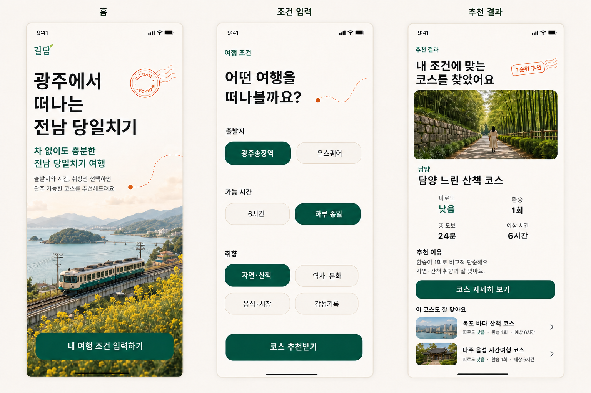

# 길담 UI·UX 디자인 방향

- 상태: Draft v1
- 기준 문서: [`docs/Gildam_PRODUCT_SPEC.md`](../Gildam_PRODUCT_SPEC.md)
- 적용 대상: 모바일 웹 MVP
- 기준 화면 폭: 390px

> 이 문서는 길담의 시각적 정체성과 정보 위계를 정의한다. 기능 범위와 화면별 필수 요소는 제품 명세를 우선하며, 목업은 구현 방향을 설명하는 참고 자료로 사용한다.

## 1. 핵심 컨셉

### 컨셉명: 길을 담는 하루

길담은 단순히 예쁜 여행지를 보여주는 앱이 아니다. 자가용 없이도 주어진 시간 안에 실제로 다녀올 수 있는지를 먼저 판단하게 하고, 그 다음 지역의 음식과 풍경, 기록할 장면을 발견하게 하는 서비스다.

**브랜드 문장**

> 갈 수 있는 길을 고르고, 기억할 장면을 담아요.

**사용자가 느껴야 하는 감정의 순서**

```text
가능 여부 확인 → 간단한 선택 → 추천에 대한 확신 → 지역의 감성 발견
```

| 구분 | 길담이 제공하는 가치 |
|---|---|
| 기능적 가치 | 실제로 완주 가능한 코스를 빠르게 판단한다. |
| 감성적 가치 | 그 지역에서 기억하고 기록할 장면을 발견한다. |
| 브랜드 인상 | 따뜻함, 신뢰감, 지역성, 가벼운 설렘 |
| 피해야 할 인상 | 관광청 홍보물, 금융 앱, 캠핑용품 브랜드, 과장된 AI 서비스 |

## 2. 디자인 원칙

길담은 토스의 시각 스타일을 복제하지 않는다. 토스에서 참고하는 것은 색상이나 무장식 표현이 아니라 정보가 읽히는 방식이다.

1. **가능성을 먼저 보여준다.** 감성 이미지보다 소요시간, 도보시간, 환승 횟수, 피로도를 먼저 이해시킨다.
2. **한 화면에는 하나의 핵심 행동만 둔다.** Primary CTA는 화면마다 한 개만 강하게 표현한다.
3. **크기와 간격으로 위계를 만든다.** 불필요한 카드, 테두리, 색상으로 정보를 구분하지 않는다.
4. **장식에는 역할을 부여한다.** 경로선은 이동 흐름, 도장은 추천의 확신, 기록 프레임은 여행의 기억을 뜻한다.
5. **감성은 판단을 방해하지 않는다.** 홈과 상세 화면에는 감성을 충분히 담되 조건 입력과 이동 정보는 빠르게 읽혀야 한다.
6. **선택을 줄이고 이유를 설명한다.** 많은 후보보다 1순위와 소수 대안을 보여주고 추천 이유를 문장으로 제공한다.

## 3. 포인트 디자인

길담의 반복 가능한 시각 언어는 `길`과 `도장` 두 축으로 제한한다.

| 요소 | 의미 | 주요 적용 위치 | 사용 규칙 |
|---|---|---|---|
| 이어지는 경로선 | 실제 이동과 여행의 흐름 | 홈 비주얼, 코스 타임라인, 로딩 | 한 화면에 한 번만 사용하고 본문 뒤에 겹치지 않는다. |
| 지점 노드 | 출발지와 여행 장소 | 일정 순서, 진행 상태 | 실제 순서 또는 상태와 연결할 때만 사용한다. |
| 추천 도장 | 검증된 추천에 대한 확신 | 1순위 추천 카드 | `1순위 추천`처럼 사실에 기반한 문구만 사용한다. |
| 기록 프레임 | 여행을 담는다는 의미 | 오늘 담아볼 장면 | 이동 정보보다 먼저 강조하지 않는다. |

장식은 제거 대상이 아니라 **브랜드 문장부호**다. 화면 전체를 꾸미는 패턴으로 사용하지 않고 의미가 생기는 지점에만 배치한다.

## 4. 컬러 시스템

밝은 청록색 중심의 기존 팔레트보다 깊은 초록과 따뜻한 중립색을 사용한다. 초록은 신뢰와 이동 가능성, 코랄은 추천과 출발, 머스터드는 지역 경험과 기록을 나타낸다.

| 토큰 제안 | 색상 | 역할 |
|---|---:|---|
| `--color-brand-700` | `#17624E` | Primary CTA, 선택 상태, 핵심 강조 |
| `--color-brand-800` | `#10483B` | 버튼 pressed 상태, 진한 브랜드 텍스트 |
| `--color-brand-100` | `#DCEDE6` | 선택 보조 배경, 경로선의 옅은 표현 |
| `--color-background` | `#FBF7EE` | 앱 기본 배경 |
| `--color-surface` | `#FFFDF8` | 카드와 주요 콘텐츠 표면 |
| `--color-accent-coral` | `#E67855` | 추천 도장, 경로 노드, 작은 강조 |
| `--color-accent-mustard` | `#D5A23C` | 지역 음식, 기록 영역의 보조 포인트 |
| `--color-text-primary` | `#202522` | 제목과 본문 |
| `--color-text-secondary` | `#6F746F` | 설명과 보조 정보 |
| `--color-border` | `#E7E0D4` | 필요한 경우에만 사용하는 구분선 |

**권장 사용 비율**

- 아이보리와 중립색: 약 70%
- 초록: 약 20%
- 코랄과 머스터드: 합계 약 10%

코랄과 머스터드는 작은 장식과 보조 강조에만 사용하며 본문 텍스트 색으로 사용하지 않는다. 피로도나 오류 상태는 색상뿐 아니라 텍스트를 함께 제공한다.

## 5. 타이포그래피

기본 서체는 Pretendard를 사용한다. 여러 서체를 섞기보다 굵기와 크기로 정보 위계를 만든다.

| 역할 | 크기 / 줄높이 | 굵기 | 사용 예시 |
|---|---|---:|---|
| Display | 32px / 40px | 700 | 홈 핵심 문장 |
| Page title | 26px / 34px | 700 | 어떤 여행을 떠나볼까요? |
| Section title | 20px / 28px | 700 | 추천 이유, 코스 순서 |
| Emphasized metric | 18–20px / 26px | 700 | 6시간, 24분, 1회 |
| Body | 16px / 25px | 400 | 설명과 추천 이유 |
| Label | 14px / 20px | 500–600 | 지역, 입력 그룹, 보조 정보 |

- 의미 있는 정보는 14px보다 작게 만들지 않는다.
- 한 화면에서 경쟁하는 글자 크기를 늘리지 않는다.
- 제목은 짧고 굵게, 설명은 친절하고 담백하게 작성한다.
- 숫자는 주변 레이블보다 크고 굵게 표현해 빠르게 비교할 수 있게 한다.

## 6. 형태, 간격, 깊이

### 간격

4px와 8px 배수를 기본으로 사용한다.

- 모바일 좌우 여백: 20px
- 관련 요소 간격: 8–12px
- 컴포넌트 내부 간격: 16–20px
- 섹션 간격: 32–40px
- 큰 맥락 전환: 48px

### Radius

- 일반 컨트롤: 14–16px
- 주요 카드와 이미지: 20px
- 선택 Chip과 짧은 태그: pill
- 모든 버튼과 카드에 pill을 사용하지 않는다.

### 그림자와 테두리

- 기본 구분은 배경 명도와 여백으로 처리한다.
- 대표 추천 카드와 고정 CTA에만 약한 그림자를 허용한다.
- 카드 안에 다시 테두리 카드를 중첩하지 않는다.
- 지표 영역에는 가로선과 세로선을 사용하지 않는다.

## 7. 이미지와 일러스트

### 사진

- 관광 홍보용 파노라마보다 사람이 실제로 걷는 눈높이의 장면을 우선한다.
- 골목, 시장, 산책길, 음식처럼 지역의 질감이 보이는 사진을 사용한다.
- 과도한 채도와 HDR 보정을 피하고 자연광과 따뜻한 색온도를 유지한다.
- 한 카드에는 대표 이미지 한 장을 크게 사용한다.

### 일러스트

- 경로선, 역과 장소를 나타내는 노드, 작은 스탬프처럼 단순한 선형 요소를 사용한다.
- 홈의 대표 일러스트를 제외하면 장식 일러스트는 한 화면에 1–2개로 제한한다.
- AI를 연상시키는 반짝임, 로봇, 마법봉 표현은 사용하지 않는다.

## 8. 화면별 정보 위계

| 화면 | 우선순위 | 감성 : 정보 | 포인트 디자인 |
|---|---|---:|---|
| 홈 | 서비스 가치 → 짧은 설명 → CTA | 60 : 40 | 대표 풍경과 경로선 |
| 조건 입력 | 질문 → 선택 항목 → 완료 CTA | 10 : 90 | 작은 출발 노드 또는 경로선 |
| 추천 결과 | 코스명 → 이동 지표 → 추천 이유 → CTA → 대안 | 30 : 70 | 1순위 추천 도장 |
| 코스 상세 | 코스 요약 → 이동 정보 → 일정 → 지역 경험 → 지도 CTA | 40 : 60 | 실제 일정과 연결된 타임라인 |
| 결과 없음·오류 | 상황 설명 → 해결 방법 → CTA | 20 : 80 | 끊어진 경로선 또는 빈 노드 |

### 홈

- 첫 화면에서 `차 없이도 실제로 갈 수 있는 전남 당일치기`라는 가치가 이해되어야 한다.
- 대표 비주얼은 감정을 만들고, CTA는 화면에서 가장 강한 요소가 된다.
- 기능이 없는 하단 내비게이션이나 보조 CTA를 추가하지 않는다.

### 조건 입력

- 출발지, 시간, 취향을 명확한 세 그룹으로 나눈다.
- 선택 상태는 초록색 채움과 함께 테두리·굵기 변화로 구분한다. 체크 아이콘은 필수가 아니다.
- 필수 조건을 선택하기 전에는 CTA가 비활성화되었다는 사실이 명확해야 한다.

### 추천 결과

- 이 화면을 길담의 대표 화면으로 삼는다.
- `6시간 · 도보 24분 · 환승 1회 · 피로도 낮음`이 이미지나 태그보다 빠르게 읽혀야 한다.
- 1순위 추천에는 작은 코랄 도장을 사용하고 대안 코스에는 사용하지 않는다.
- 추천 이유는 점수가 아니라 2–3개의 짧은 문장으로 설명한다.
- 대안 코스는 대표 코스보다 작은 행 또는 간결한 카드로 표현한다.

### 코스 상세

- 상단은 실제 이동 판단을 위한 정보, 하단은 지역 경험과 기록 정보로 나눈다.
- 경로선은 장식이 아니라 코스 순서를 나타내는 타임라인으로 사용한다.
- 하단 CTA가 마지막 콘텐츠를 가리지 않도록 안전 여백을 확보한다.

## 9. 인터랙션과 모션

- 선택 상태 전환: 150–200ms, 배경색과 테두리 변화
- 버튼 pressed 상태: 명도 변화, 레이아웃 이동 없음
- 결과 진입: 경로 노드가 순서대로 나타나는 짧은 표현 또는 콘텐츠 fade-up
- 로딩: 결과 카드와 동일한 크기의 skeleton 사용
- 화면당 눈에 띄는 모션은 최대 1–2개
- `prefers-reduced-motion` 환경에서는 이동 애니메이션을 제거한다.

## 10. 접근성 원칙

- 본문과 배경의 명도 대비는 WCAG AA를 충족한다.
- 터치 영역은 최소 44×44px로 유지한다.
- 선택 상태, 피로도, 오류 상태를 색상만으로 전달하지 않는다.
- 선택형 버튼에는 `aria-pressed`를 적용한다.
- `focus-visible`을 명확하게 제공한다.
- 긴 코스명과 추천 이유는 말줄임보다 줄바꿈을 우선한다.
- 320px에서도 가로 스크롤이 발생하지 않아야 한다.

## 11. 피해야 할 패턴

- 모든 콘텐츠를 둥근 카드 안에 넣기
- 모든 버튼과 레이블을 pill로 만들기
- 화면마다 다른 포인트 컬러 사용하기
- 초록색 텍스트를 과도하게 사용하기
- 스탬프, 스티커, 경로선을 동시에 여러 개 배치하기
- 관광 홍보물처럼 큰 사진과 감성 문구만 강조하기
- 이동 정보보다 취향 태그와 장식을 먼저 보여주기
- 작은 캡션과 흐린 회색 텍스트로 정보를 압축하기
- `AI가 완벽한 여행을 설계한다`는 식의 과장된 표현 사용하기

## 12. 구현 우선순위

1. 컬러, 타이포그래피, 간격, radius 토큰을 확정한다.
2. 추천 결과 화면을 기준 화면으로 재설계한다.
3. 공통 Button, SelectableChip, CourseCard, TravelMetric에 시스템을 반영한다.
4. 홈과 조건 입력 화면을 같은 위계 원칙으로 정리한다.
5. 코스 상세와 피드백 상태에 경로·기록 모티프를 확장한다.
6. 320px, 390px, 768px에서 반응형과 접근성을 확인한다.

## 13. 디자인 검수 체크리스트

- [ ] 첫 화면에서 길담이 차 없는 당일치기 추천 서비스임을 이해할 수 있다.
- [ ] 각 화면의 Primary CTA가 하나만 명확하게 보인다.
- [ ] 추천 결과에서 이동 지표를 3초 안에 파악할 수 있다.
- [ ] 장식 요소가 실제 의미 또는 상태와 연결되어 있다.
- [ ] 스탬프와 경로선이 한 화면에서 경쟁하지 않는다.
- [ ] 감성 이미지보다 이동 가능성 정보가 먼저 이해된다.
- [ ] 본문 크기가 16px을 기본으로 유지한다.
- [ ] 선택 상태와 피로도를 색상 외의 표현으로도 구분할 수 있다.
- [ ] 모바일에서 긴 텍스트와 하단 CTA가 잘리지 않는다.
- [ ] 제품 명세에 없는 기능이나 내비게이션을 노출하지 않는다.

## 14. 컨셉 목업

아래 목업은 홈, 조건 입력, 추천 결과의 정보 위계와 브랜드 표현을 보여주는 기준 시안이다.



> 목업은 색상, 정보 위계, 간격과 포인트 디자인을 확인하기 위한 시각 자료다. 이미지 생성 과정에서 발생한 한글 표기 오차는 구현 기준이 아니며, 실제 문구와 데이터는 제품 명세와 mock data를 따른다.
